# AuADHD Mod Thumbnail Cards

Generated from the requested progression categories. Each entry has a PNG card, a short mod description, and one possible integration idea for the pack.

## Core Progression

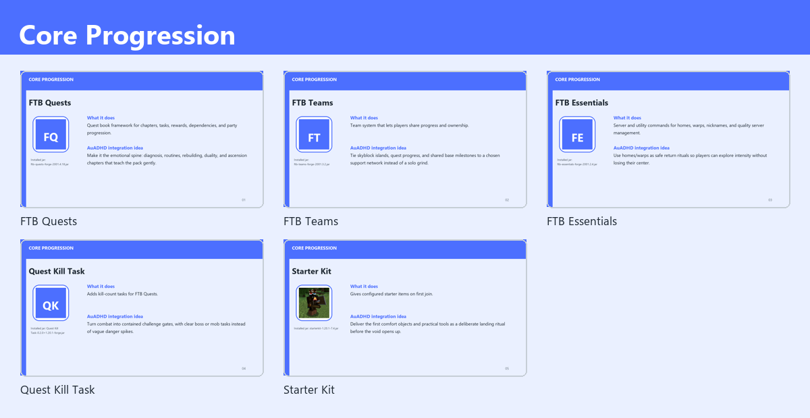

### FTB Quests
- PNG: `notes/mod_thumbnail_cards/cards/01-core-progression-ftb-quests.png`
- Description: Quest book framework for chapters, tasks, rewards, dependencies, and party progression.
- Integration: Make it the emotional spine: diagnosis, routines, rebuilding, duality, and ascension chapters that teach the pack gently.
- Matched jar: `ftb-quests-forge-2001.4.18.jar`

### FTB Teams
- PNG: `notes/mod_thumbnail_cards/cards/02-core-progression-ftb-teams.png`
- Description: Team system that lets players share progress and ownership.
- Integration: Tie skyblock islands, quest progress, and shared base milestones to a chosen support network instead of a solo grind.
- Matched jar: `ftb-teams-forge-2001.3.2.jar`

### FTB Essentials
- PNG: `notes/mod_thumbnail_cards/cards/03-core-progression-ftb-essentials.png`
- Description: Server and utility commands for homes, warps, nicknames, and quality server management.
- Integration: Use homes/warps as safe return rituals so players can explore intensity without losing their center.
- Matched jar: `ftb-essentials-forge-2001.2.4.jar`

### Quest Kill Task
- PNG: `notes/mod_thumbnail_cards/cards/04-core-progression-quest-kill-task.png`
- Description: Adds kill-count tasks for FTB Quests.
- Integration: Turn combat into contained challenge gates, with clear boss or mob tasks instead of vague danger spikes.
- Matched jar: `Quest Kill Task-0.2.0+1.20.1-forge.jar`

### Starter Kit
- PNG: `notes/mod_thumbnail_cards/cards/05-core-progression-starter-kit.png`
- Description: Gives configured starter items on first join.
- Integration: Deliver the first comfort objects and practical tools as a deliberate landing ritual before the void opens up.
- Matched jar: `starterkit-1.20.1-7.4.jar`

## Skyblock Foundation

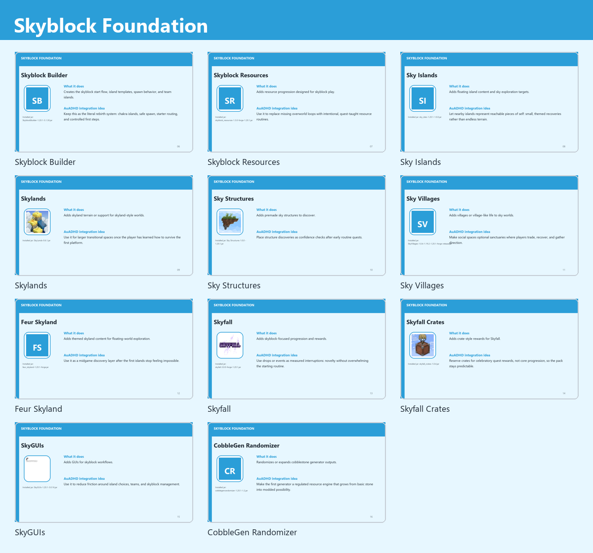

### Skyblock Builder
- PNG: `notes/mod_thumbnail_cards/cards/06-skyblock-foundation-skyblock-builder.png`
- Description: Creates the skyblock start flow, island templates, spawn behavior, and team islands.
- Integration: Keep this as the literal rebirth system: chakra islands, safe spawn, starter routing, and controlled first steps.
- Matched jar: `SkyblockBuilder-1.20.1-5.1.30.jar`

### Skyblock Resources
- PNG: `notes/mod_thumbnail_cards/cards/07-skyblock-foundation-skyblock-resources.png`
- Description: Adds resource progression designed for skyblock play.
- Integration: Use it to replace missing overworld loops with intentional, quest-taught resource routines.
- Matched jar: `skyblock_resources-1.3.0-forge-1.20.1.jar`

### Sky Islands
- PNG: `notes/mod_thumbnail_cards/cards/08-skyblock-foundation-sky-islands.png`
- Description: Adds floating island content and sky exploration targets.
- Integration: Let nearby islands represent reachable pieces of self: small, themed recoveries rather than endless terrain.
- Matched jar: `sky_isles-1.20.1-1.0.0.jar`

### Skylands
- PNG: `notes/mod_thumbnail_cards/cards/09-skyblock-foundation-skylands.png`
- Description: Adds skyland terrain or support for skyland-style worlds.
- Integration: Use it for larger transitional spaces once the player has learned how to survive the first platform.
- Matched jar: `SkyLands-0.6.1.jar`

### Sky Structures
- PNG: `notes/mod_thumbnail_cards/cards/10-skyblock-foundation-sky-structures.png`
- Description: Adds premade sky structures to discover.
- Integration: Place structure discoveries as confidence checks after early routine quests.
- Matched jar: `Sky Structures 1.0.0 - 1.20.1.jar`

### Sky Villages
- PNG: `notes/mod_thumbnail_cards/cards/11-skyblock-foundation-sky-villages.png`
- Description: Adds villages or village-like life to sky worlds.
- Integration: Make social spaces optional sanctuaries where players trade, recover, and gather direction.
- Matched jar: `SkyVillages-1.0.4-1.19.2-1.20.1-forge-release.jar`

### Feur Skyland
- PNG: `notes/mod_thumbnail_cards/cards/12-skyblock-foundation-feur-skyland.png`
- Description: Adds themed skyland content for floating-world exploration.
- Integration: Use it as a midgame discovery layer after the first islands stop feeling impossible.
- Matched jar: `feur_skyland-1.20.1-forge.jar`

### Skyfall
- PNG: `notes/mod_thumbnail_cards/cards/13-skyblock-foundation-skyfall.png`
- Description: Adds skyblock-focused progression and rewards.
- Integration: Use drops or events as measured interruptions: novelty without overwhelming the starting routine.
- Matched jar: `skyfall-3.0.0-forge-1.20.1.jar`

### Skyfall Crates
- PNG: `notes/mod_thumbnail_cards/cards/14-skyblock-foundation-skyfall-crates.png`
- Description: Adds crate-style rewards for Skyfall.
- Integration: Reserve crates for celebratory quest rewards, not core progression, so the pack stays predictable.
- Matched jar: `skyfall_crates-1.0.4.jar`

### SkyGUIs
- PNG: `notes/mod_thumbnail_cards/cards/15-skyblock-foundation-skyguis.png`
- Description: Adds GUIs for skyblock workflows.
- Integration: Use it to reduce friction around island choices, teams, and skyblock management.
- Matched jar: `SkyGUIs-1.20.1-3.0.16.jar`

### CobbleGen Randomizer
- PNG: `notes/mod_thumbnail_cards/cards/16-skyblock-foundation-cobblegen-randomizer.png`
- Description: Randomizes or expands cobblestone generator outputs.
- Integration: Make the first generator a regulated resource engine that grows from basic stone into modded possibility.
- Matched jar: `cobblegenrandomizer-1.20.1-1.2.jar`

## Systems & Automation

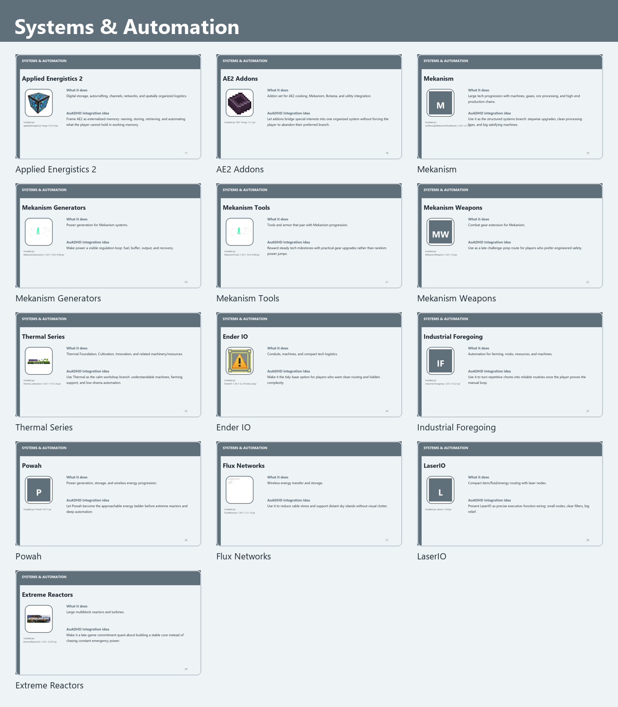

### Applied Energistics 2
- PNG: `notes/mod_thumbnail_cards/cards/17-systems-automation-applied-energistics-2.png`
- Description: Digital storage, autocrafting, channels, networks, and spatially organized logistics.
- Integration: Frame AE2 as externalized memory: naming, storing, retrieving, and automating what the player cannot hold in working memory.
- Matched jar: `appliedenergistics2-forge-15.4.10.jar`

### AE2 Addons
- PNG: `notes/mod_thumbnail_cards/cards/18-systems-automation-ae2-addons.png`
- Description: Addon set for AE2 cooking, Mekanism, Botania, and utility integration.
- Integration: Let addons bridge special interests into one organized system without forcing the player to abandon their preferred branch.
- Matched jar: `AE2-Things-1.2.1.jar`

### Mekanism
- PNG: `notes/mod_thumbnail_cards/cards/19-systems-automation-mekanism.png`
- Description: Large tech progression with machines, gases, ore processing, and high-end production chains.
- Integration: Use it as the structured systems branch: stepwise upgrades, clean processing lines, and big satisfying machines.
- Matched jar: `JustEnoughMekanismMultiblocks-1.20.1-4.17.jar`

### Mekanism Generators
- PNG: `notes/mod_thumbnail_cards/cards/20-systems-automation-mekanism-generators.png`
- Description: Power generation for Mekanism systems.
- Integration: Make power a visible regulation loop: fuel, buffer, output, and recovery.
- Matched jar: `MekanismGenerators-1.20.1-10.4.16.80.jar`

### Mekanism Tools
- PNG: `notes/mod_thumbnail_cards/cards/21-systems-automation-mekanism-tools.png`
- Description: Tools and armor that pair with Mekanism progression.
- Integration: Reward steady tech milestones with practical gear upgrades rather than random power jumps.
- Matched jar: `MekanismTools-1.20.1-10.4.16.80.jar`

### Mekanism Weapons
- PNG: `notes/mod_thumbnail_cards/cards/22-systems-automation-mekanism-weapons.png`
- Description: Combat gear extension for Mekanism.
- Integration: Use as a late challenge-prep route for players who prefer engineered safety.
- Matched jar: `MekanismWeapons-1.20.1-3.0.jar`

### Thermal Series
- PNG: `notes/mod_thumbnail_cards/cards/23-systems-automation-thermal-series.png`
- Description: Thermal Foundation, Cultivation, Innovation, and related machinery/resources.
- Integration: Use Thermal as the calm workshop branch: understandable machines, farming support, and low-drama automation.
- Matched jar: `thermal_cultivation-1.20.1-11.0.1.24.jar`

### Ender IO
- PNG: `notes/mod_thumbnail_cards/cards/24-systems-automation-ender-io.png`
- Description: Conduits, machines, and compact tech logistics.
- Integration: Make it the tidy-base option for players who want clean routing and hidden complexity.
- Matched jar: `EnderIO-1.20.1-6.2.18-beta-all.jar`

### Industrial Foregoing
- PNG: `notes/mod_thumbnail_cards/cards/25-systems-automation-industrial-foregoing.png`
- Description: Automation for farming, mobs, resources, and machines.
- Integration: Use it to turn repetitive chores into reliable routines once the player proves the manual loop.
- Matched jar: `industrial-foregoing-1.20.1-3.5.21.jar`

### Powah
- PNG: `notes/mod_thumbnail_cards/cards/26-systems-automation-powah.png`
- Description: Power generation, storage, and wireless energy progression.
- Integration: Let Powah become the approachable energy ladder before extreme reactors and deep automation.
- Matched jar: `Powah-5.0.11.jar`

### Flux Networks
- PNG: `notes/mod_thumbnail_cards/cards/27-systems-automation-flux-networks.png`
- Description: Wireless energy transfer and storage.
- Integration: Use it to reduce cable stress and support distant sky islands without visual clutter.
- Matched jar: `FluxNetworks-1.20.1-7.2.1.15.jar`

### LaserIO
- PNG: `notes/mod_thumbnail_cards/cards/28-systems-automation-laserio.png`
- Description: Compact item/fluid/energy routing with laser nodes.
- Integration: Present LaserIO as precise executive-function wiring: small nodes, clear filters, big relief.
- Matched jar: `laserio-1.6.8.jar`

### Extreme Reactors
- PNG: `notes/mod_thumbnail_cards/cards/29-systems-automation-extreme-reactors.png`
- Description: Large multiblock reactors and turbines.
- Integration: Make it a late-game commitment quest about building a stable core instead of chasing constant emergency power.
- Matched jar: `ExtremeReactors2-1.20.1-2.0.97.jar`

## Grounding & Routine

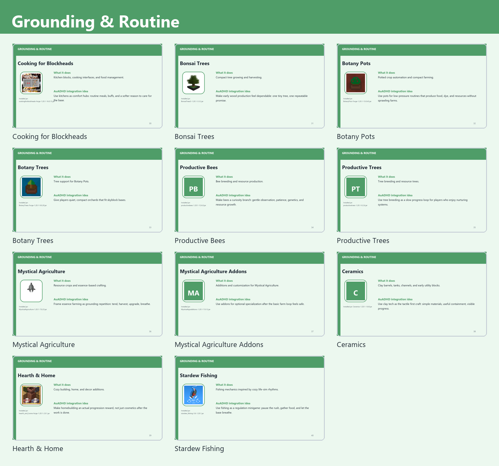

### Cooking for Blockheads
- PNG: `notes/mod_thumbnail_cards/cards/30-grounding-routine-cooking-for-blockheads.png`
- Description: Kitchen blocks, cooking interfaces, and food management.
- Integration: Use kitchens as comfort hubs: routine meals, buffs, and a softer reason to care for the base.
- Matched jar: `cookingforblockheads-forge-1.20.1-16.0.15.jar`

### Bonsai Trees
- PNG: `notes/mod_thumbnail_cards/cards/31-grounding-routine-bonsai-trees.png`
- Description: Compact tree growing and harvesting.
- Integration: Make early wood production feel dependable: one tiny tree, one repeatable promise.
- Matched jar: `BonsaiTrees3-1.20.1-3.3.2.jar`

### Botany Pots
- PNG: `notes/mod_thumbnail_cards/cards/32-grounding-routine-botany-pots.png`
- Description: Potted crop automation and compact farming.
- Integration: Use pots for low-pressure routines that produce food, dye, and resources without sprawling farms.
- Matched jar: `BotanyPots-Forge-1.20.1-13.0.43.jar`

### Botany Trees
- PNG: `notes/mod_thumbnail_cards/cards/33-grounding-routine-botany-trees.png`
- Description: Tree support for Botany Pots.
- Integration: Give players quiet, compact orchards that fit skyblock bases.
- Matched jar: `BotanyTrees-Forge-1.20.1-9.0.20.jar`

### Productive Bees
- PNG: `notes/mod_thumbnail_cards/cards/34-grounding-routine-productive-bees.png`
- Description: Bee breeding and resource production.
- Integration: Make bees a curiosity branch: gentle observation, patience, genetics, and resource growth.
- Matched jar: `productivebees-1.20.1-12.6.0.jar`

### Productive Trees
- PNG: `notes/mod_thumbnail_cards/cards/35-grounding-routine-productive-trees.png`
- Description: Tree breeding and resource trees.
- Integration: Use tree breeding as a slow progress loop for players who enjoy nurturing systems.
- Matched jar: `productivetrees-1.20.1-0.2.6.jar`

### Mystical Agriculture
- PNG: `notes/mod_thumbnail_cards/cards/36-grounding-routine-mystical-agriculture.png`
- Description: Resource crops and essence-based crafting.
- Integration: Frame essence farming as grounding repetition: tend, harvest, upgrade, breathe.
- Matched jar: `MysticalAgriculture-1.20.1-7.0.23.jar`

### Mystical Agriculture Addons
- PNG: `notes/mod_thumbnail_cards/cards/37-grounding-routine-mystical-agriculture-addons.png`
- Description: Additions and customization for Mystical Agriculture.
- Integration: Use addons for optional specialization after the basic farm loop feels safe.
- Matched jar: `MysticalAgradditions-1.20.1-7.0.12.jar`

### Ceramics
- PNG: `notes/mod_thumbnail_cards/cards/38-grounding-routine-ceramics.png`
- Description: Clay barrels, tanks, channels, and early utility blocks.
- Integration: Use clay tech as the tactile first craft: simple materials, useful containment, visible progress.
- Matched jar: `Ceramics-1.20.1-1.8.0.jar`

### Hearth & Home
- PNG: `notes/mod_thumbnail_cards/cards/39-grounding-routine-hearth-home.png`
- Description: Cozy building, home, and decor additions.
- Integration: Make homebuilding an actual progression reward, not just cosmetics after the work is done.
- Matched jar: `hearth_and_home-forge-1.20.1-2.0.1.jar`

### Stardew Fishing
- PNG: `notes/mod_thumbnail_cards/cards/40-grounding-routine-stardew-fishing.png`
- Description: Fishing mechanics inspired by cozy life-sim rhythms.
- Integration: Use fishing as a regulation minigame: pause the rush, gather food, and let the base breathe.
- Matched jar: `stardew_fishing-3.6-1.20.1.jar`

## Magic & Intuition

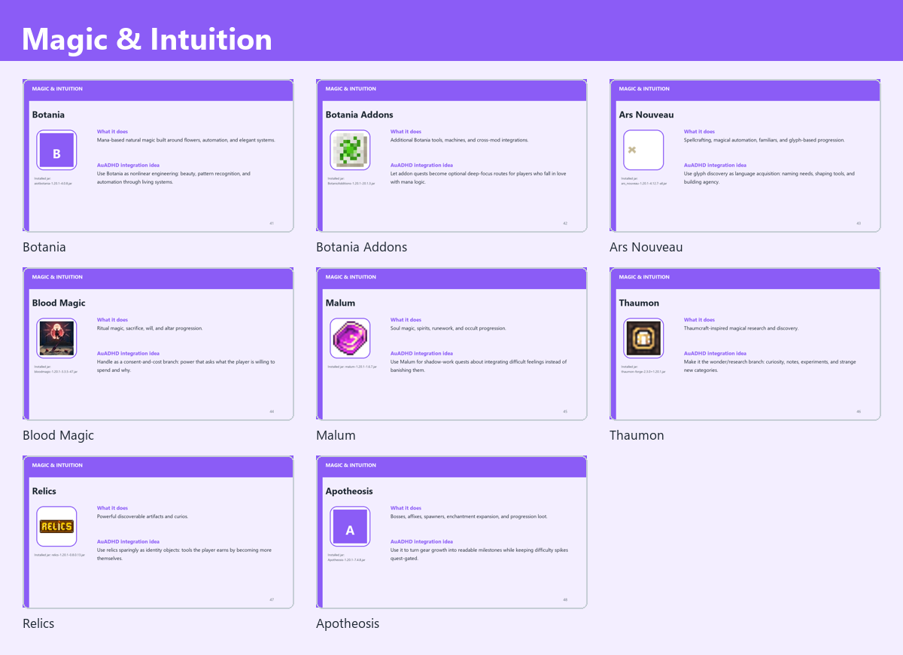

### Botania
- PNG: `notes/mod_thumbnail_cards/cards/41-magic-intuition-botania.png`
- Description: Mana-based natural magic built around flowers, automation, and elegant systems.
- Integration: Use Botania as nonlinear engineering: beauty, pattern recognition, and automation through living systems.
- Matched jar: `aiotbotania-1.20.1-4.0.8.jar`

### Botania Addons
- PNG: `notes/mod_thumbnail_cards/cards/42-magic-intuition-botania-addons.png`
- Description: Additional Botania tools, machines, and cross-mod integrations.
- Integration: Let addon quests become optional deep-focus routes for players who fall in love with mana logic.
- Matched jar: `BotanicAdditions-1.20.1-20.1.3.jar`

### Ars Nouveau
- PNG: `notes/mod_thumbnail_cards/cards/43-magic-intuition-ars-nouveau.png`
- Description: Spellcrafting, magical automation, familiars, and glyph-based progression.
- Integration: Use glyph discovery as language acquisition: naming needs, shaping tools, and building agency.
- Matched jar: `ars_nouveau-1.20.1-4.12.7-all.jar`

### Blood Magic
- PNG: `notes/mod_thumbnail_cards/cards/44-magic-intuition-blood-magic.png`
- Description: Ritual magic, sacrifice, will, and altar progression.
- Integration: Handle as a consent-and-cost branch: power that asks what the player is willing to spend and why.
- Matched jar: `bloodmagic-1.20.1-3.3.5-47.jar`

### Malum
- PNG: `notes/mod_thumbnail_cards/cards/45-magic-intuition-malum.png`
- Description: Soul magic, spirits, runework, and occult progression.
- Integration: Use Malum for shadow-work quests about integrating difficult feelings instead of banishing them.
- Matched jar: `malum-1.20.1-1.6.7.jar`

### Thaumon
- PNG: `notes/mod_thumbnail_cards/cards/46-magic-intuition-thaumon.png`
- Description: Thaumcraft-inspired magical research and discovery.
- Integration: Make it the wonder/research branch: curiosity, notes, experiments, and strange new categories.
- Matched jar: `thaumon-forge-2.3.0+1.20.1.jar`

### Relics
- PNG: `notes/mod_thumbnail_cards/cards/47-magic-intuition-relics.png`
- Description: Powerful discoverable artifacts and curios.
- Integration: Use relics sparingly as identity objects: tools the player earns by becoming more themselves.
- Matched jar: `relics-1.20.1-0.8.0.13.jar`

### Apotheosis
- PNG: `notes/mod_thumbnail_cards/cards/48-magic-intuition-apotheosis.png`
- Description: Bosses, affixes, spawners, enchantment expansion, and progression loot.
- Integration: Use it to turn gear growth into readable milestones while keeping difficulty spikes quest-gated.
- Matched jar: `Apotheosis-1.20.1-7.4.8.jar`

## Challenge & Chaos

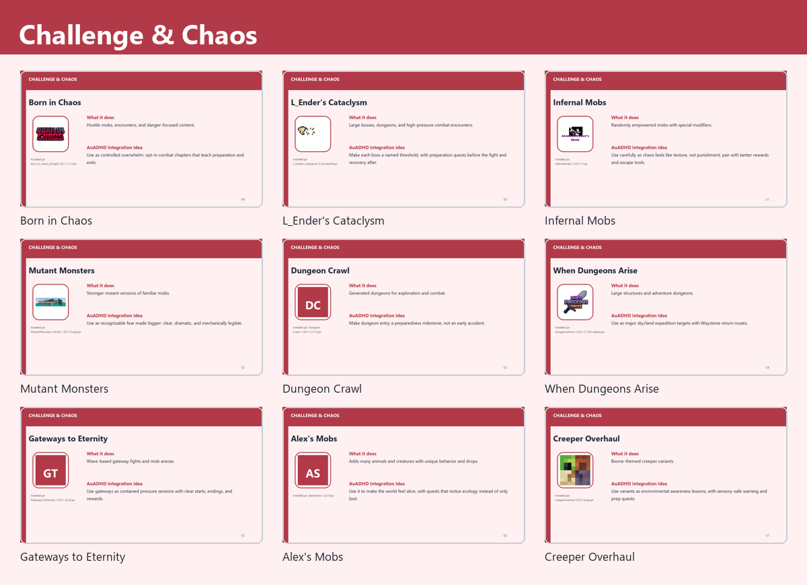

### Born in Chaos
- PNG: `notes/mod_thumbnail_cards/cards/49-challenge-chaos-born-in-chaos.png`
- Description: Hostile mobs, encounters, and danger-focused content.
- Integration: Use as controlled overwhelm: opt-in combat chapters that teach preparation and exits.
- Matched jar: `born_in_chaos_[Forge]1.20.1_1.7.4.jar`

### L_Ender's Cataclysm
- PNG: `notes/mod_thumbnail_cards/cards/50-challenge-chaos-l-ender-s-cataclysm.png`
- Description: Large bosses, dungeons, and high-pressure combat encounters.
- Integration: Make each boss a named threshold, with preparation quests before the fight and recovery after.
- Matched jar: `L_Enders_Cataclysm-3.26-laserfix.jar`

### Infernal Mobs
- PNG: `notes/mod_thumbnail_cards/cards/51-challenge-chaos-infernal-mobs.png`
- Description: Randomly empowered mobs with special modifiers.
- Integration: Use carefully so chaos feels like texture, not punishment; pair with better rewards and escape tools.
- Matched jar: `infernalmobs-1.20.1.11.jar`

### Mutant Monsters
- PNG: `notes/mod_thumbnail_cards/cards/52-challenge-chaos-mutant-monsters.png`
- Description: Stronger mutant versions of familiar mobs.
- Integration: Use as recognizable fear made bigger: clear, dramatic, and mechanically legible.
- Matched jar: `MutantMonsters-v8.0.8-1.20.1-Forge.jar`

### Dungeon Crawl
- PNG: `notes/mod_thumbnail_cards/cards/53-challenge-chaos-dungeon-crawl.png`
- Description: Generated dungeons for exploration and combat.
- Integration: Make dungeon entry a preparedness milestone, not an early accident.
- Matched jar: `Dungeon Crawl-1.20.1-2.3.15.jar`

### When Dungeons Arise
- PNG: `notes/mod_thumbnail_cards/cards/54-challenge-chaos-when-dungeons-arise.png`
- Description: Large structures and adventure dungeons.
- Integration: Use as major sky/land expedition targets with Waystone return routes.
- Matched jar: `DungeonsArise-1.20.x-2.1.58-release.jar`

### Gateways to Eternity
- PNG: `notes/mod_thumbnail_cards/cards/55-challenge-chaos-gateways-to-eternity.png`
- Description: Wave-based gateway fights and mob arenas.
- Integration: Use gateways as contained pressure sessions with clear starts, endings, and rewards.
- Matched jar: `GatewaysToEternity-1.20.1-4.2.6.jar`

### Alex's Mobs
- PNG: `notes/mod_thumbnail_cards/cards/56-challenge-chaos-alex-s-mobs.png`
- Description: Adds many animals and creatures with unique behavior and drops.
- Integration: Use it to make the world feel alive, with quests that notice ecology instead of only loot.
- Matched jar: `alexsmobs-1.22.9.jar`

### Creeper Overhaul
- PNG: `notes/mod_thumbnail_cards/cards/57-challenge-chaos-creeper-overhaul.png`
- Description: Biome-themed creeper variants.
- Integration: Use variants as environmental awareness lessons, with sensory-safe warning and prep quests.
- Matched jar: `creeperoverhaul-3.0.2-forge.jar`

## Exploration & Movement

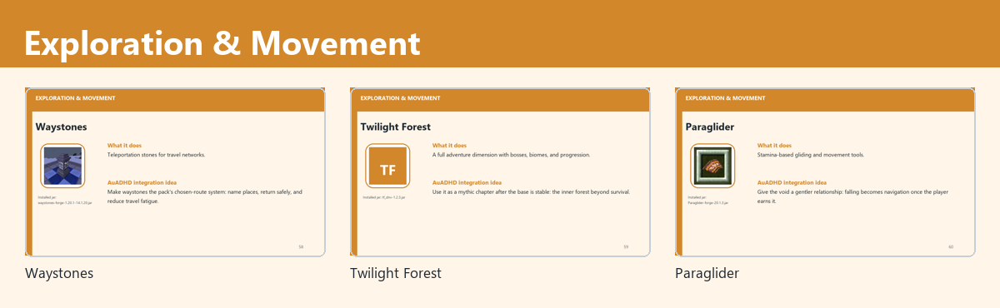

### Waystones
- PNG: `notes/mod_thumbnail_cards/cards/58-exploration-movement-waystones.png`
- Description: Teleportation stones for travel networks.
- Integration: Make waystones the pack's chosen-route system: name places, return safely, and reduce travel fatigue.
- Matched jar: `waystones-forge-1.20.1-14.1.20.jar`

### Twilight Forest
- PNG: `notes/mod_thumbnail_cards/cards/59-exploration-movement-twilight-forest.png`
- Description: A full adventure dimension with bosses, biomes, and progression.
- Integration: Use it as a mythic chapter after the base is stable: the inner forest beyond survival.
- Matched jar: `tf_dnv-1.2.3.jar`

### Paraglider
- PNG: `notes/mod_thumbnail_cards/cards/60-exploration-movement-paraglider.png`
- Description: Stamina-based gliding and movement tools.
- Integration: Give the void a gentler relationship: falling becomes navigation once the player earns it.
- Matched jar: `Paraglider-forge-20.1.3.jar`

## Quality of Life

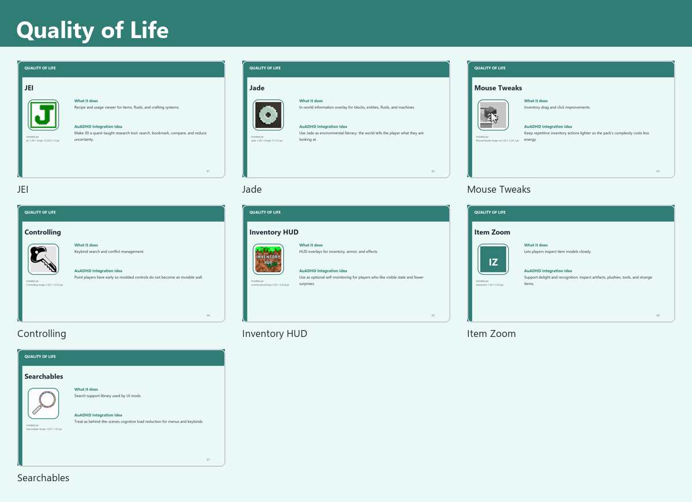

### JEI
- PNG: `notes/mod_thumbnail_cards/cards/61-quality-of-life-jei.png`
- Description: Recipe and usage viewer for items, fluids, and crafting systems.
- Integration: Make JEI a quest-taught research tool: search, bookmark, compare, and reduce uncertainty.
- Matched jar: `jei-1.20.1-forge-15.20.0.112.jar`

### Jade
- PNG: `notes/mod_thumbnail_cards/cards/62-quality-of-life-jade.png`
- Description: In-world information overlay for blocks, entities, fluids, and machines.
- Integration: Use Jade as environmental literacy: the world tells the player what they are looking at.
- Matched jar: `Jade-1.20.1-Forge-11.13.2.jar`

### Mouse Tweaks
- PNG: `notes/mod_thumbnail_cards/cards/63-quality-of-life-mouse-tweaks.png`
- Description: Inventory drag and click improvements.
- Integration: Keep repetitive inventory actions lighter so the pack's complexity costs less energy.
- Matched jar: `MouseTweaks-forge-mc1.20.1-2.25.1.jar`

### Controlling
- PNG: `notes/mod_thumbnail_cards/cards/64-quality-of-life-controlling.png`
- Description: Keybind search and conflict management.
- Integration: Point players here early so modded controls do not become an invisible wall.
- Matched jar: `Controlling-forge-1.20.1-12.0.2.jar`

### Inventory HUD
- PNG: `notes/mod_thumbnail_cards/cards/65-quality-of-life-inventory-hud.png`
- Description: HUD overlays for inventory, armor, and effects.
- Integration: Use as optional self-monitoring for players who like visible state and fewer surprises.
- Matched jar: `inventoryhud.forge.1.20.1-3.4.26.jar`

### Item Zoom
- PNG: `notes/mod_thumbnail_cards/cards/66-quality-of-life-item-zoom.png`
- Description: Lets players inspect item models closely.
- Integration: Support delight and recognition: inspect artifacts, plushies, tools, and strange items.
- Matched jar: `itemzoom-1.20.1-2.9.0.jar`

### Searchables
- PNG: `notes/mod_thumbnail_cards/cards/67-quality-of-life-searchables.png`
- Description: Search support library used by UI mods.
- Integration: Treat as behind-the-scenes cognitive load reduction for menus and keybinds.
- Matched jar: `Searchables-forge-1.20.1-1.0.3.jar`

## Inventory & Load Management

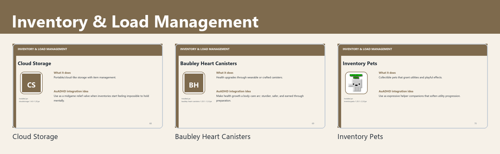

### Cloud Storage
- PNG: `notes/mod_thumbnail_cards/cards/68-inventory-load-management-cloud-storage.png`
- Description: Portable/cloud-like storage with item management.
- Integration: Use as a midgame relief valve when inventories start feeling impossible to hold mentally.
- Matched jar: `cloudstorage-1.4.0-1.20.jar`

### Baubley Heart Canisters
- PNG: `notes/mod_thumbnail_cards/cards/69-inventory-load-management-baubley-heart-canisters.png`
- Description: Health upgrades through wearable or crafted canisters.
- Integration: Make health growth a body-care arc: sturdier, safer, and earned through preparation.
- Matched jar: `baubley-heart-canisters-1.20.1-1.2.0.jar`

### Inventory Pets
- PNG: `notes/mod_thumbnail_cards/cards/70-inventory-load-management-inventory-pets.png`
- Description: Collectible pets that grant utilities and playful effects.
- Integration: Use as expressive helper companions that soften utility progression.
- Matched jar: `inventorypets-1.20.1-2.2.8.jar`

## Comfort & Expression

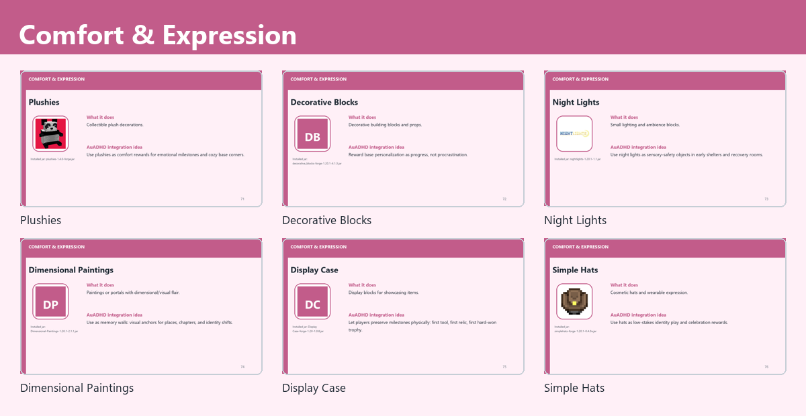

### Plushies
- PNG: `notes/mod_thumbnail_cards/cards/71-comfort-expression-plushies.png`
- Description: Collectible plush decorations.
- Integration: Use plushies as comfort rewards for emotional milestones and cozy base corners.
- Matched jar: `plushies-1.4.0-forge.jar`

### Decorative Blocks
- PNG: `notes/mod_thumbnail_cards/cards/72-comfort-expression-decorative-blocks.png`
- Description: Decorative building blocks and props.
- Integration: Reward base personalization as progress, not procrastination.
- Matched jar: `decorative_blocks-forge-1.20.1-4.1.3.jar`

### Night Lights
- PNG: `notes/mod_thumbnail_cards/cards/73-comfort-expression-night-lights.png`
- Description: Small lighting and ambience blocks.
- Integration: Use night lights as sensory-safety objects in early shelters and recovery rooms.
- Matched jar: `nightlights-1.20.1-1.1.jar`

### Dimensional Paintings
- PNG: `notes/mod_thumbnail_cards/cards/74-comfort-expression-dimensional-paintings.png`
- Description: Paintings or portals with dimensional/visual flair.
- Integration: Use as memory walls: visual anchors for places, chapters, and identity shifts.
- Matched jar: `Dimensional-Paintings-1.20.1-2.1.1.jar`

### Display Case
- PNG: `notes/mod_thumbnail_cards/cards/75-comfort-expression-display-case.png`
- Description: Display blocks for showcasing items.
- Integration: Let players preserve milestones physically: first tool, first relic, first hard-won trophy.
- Matched jar: `Display Case-forge-1.20-1.0.8.jar`

### Simple Hats
- PNG: `notes/mod_thumbnail_cards/cards/76-comfort-expression-simple-hats.png`
- Description: Cosmetic hats and wearable expression.
- Integration: Use hats as low-stakes identity play and celebration rewards.
- Matched jar: `simplehats-forge-1.20.1-0.4.0a.jar`

## Performance & Optimization

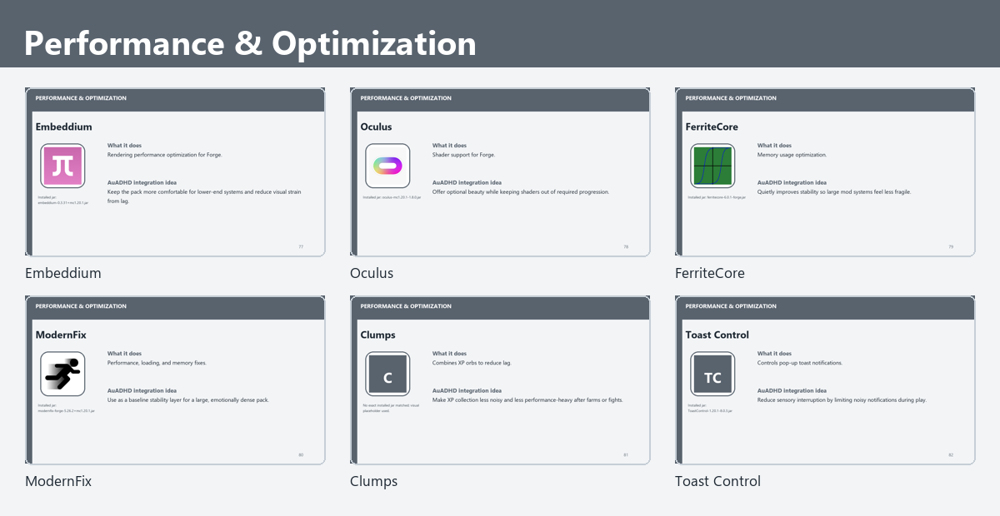

### Embeddium
- PNG: `notes/mod_thumbnail_cards/cards/77-performance-optimization-embeddium.png`
- Description: Rendering performance optimization for Forge.
- Integration: Keep the pack more comfortable for lower-end systems and reduce visual strain from lag.
- Matched jar: `embeddium-0.3.31+mc1.20.1.jar`

### Oculus
- PNG: `notes/mod_thumbnail_cards/cards/78-performance-optimization-oculus.png`
- Description: Shader support for Forge.
- Integration: Offer optional beauty while keeping shaders out of required progression.
- Matched jar: `oculus-mc1.20.1-1.8.0.jar`

### FerriteCore
- PNG: `notes/mod_thumbnail_cards/cards/79-performance-optimization-ferritecore.png`
- Description: Memory usage optimization.
- Integration: Quietly improves stability so large mod systems feel less fragile.
- Matched jar: `ferritecore-6.0.1-forge.jar`

### ModernFix
- PNG: `notes/mod_thumbnail_cards/cards/80-performance-optimization-modernfix.png`
- Description: Performance, loading, and memory fixes.
- Integration: Use as a baseline stability layer for a large, emotionally dense pack.
- Matched jar: `modernfix-forge-5.26.2+mc1.20.1.jar`

### Clumps
- PNG: `notes/mod_thumbnail_cards/cards/81-performance-optimization-clumps.png`
- Description: Combines XP orbs to reduce lag.
- Integration: Make XP collection less noisy and less performance-heavy after farms or fights.
- Matched jar: `not matched`

### Toast Control
- PNG: `notes/mod_thumbnail_cards/cards/82-performance-optimization-toast-control.png`
- Description: Controls pop-up toast notifications.
- Integration: Reduce sensory interruption by limiting noisy notifications during play.
- Matched jar: `ToastControl-1.20.1-8.0.3.jar`

## Libraries & Dependencies

### Architectury
- PNG: `notes/mod_thumbnail_cards/cards/83-libraries-dependencies-architectury.png`
- Description: Cross-loader API library used by many mods.
- Integration: Keep documented as a required backend piece, not player-facing progression.
- Matched jar: `architectury-9.2.14-forge.jar`

### Curios
- PNG: `notes/mod_thumbnail_cards/cards/84-libraries-dependencies-curios.png`
- Description: Accessory slot API for trinkets, relics, and wearable upgrades.
- Integration: Use as the equipment backbone for identity objects and practical supports.
- Matched jar: `curios-forge-5.14.1+1.20.1.jar`

### GeckoLib
- PNG: `notes/mod_thumbnail_cards/cards/85-libraries-dependencies-geckolib.png`
- Description: Animation library for entity and item animations.
- Integration: Supports animated mobs, magic, and expressive mod content behind the scenes.
- Matched jar: `geckolib-forge-1.20.1-4.8.3.jar`

### Bookshelf
- PNG: `notes/mod_thumbnail_cards/cards/86-libraries-dependencies-bookshelf.png`
- Description: Shared library for mod features and utilities.
- Integration: Document as part of the pack's dependency base so updates stay understandable.
- Matched jar: `Bookshelf-Forge-1.20.1-20.2.15.jar`

### Placebo
- PNG: `notes/mod_thumbnail_cards/cards/87-libraries-dependencies-placebo.png`
- Description: Library required by Apotheosis and related mods.
- Integration: Keep tied to Apotheosis in maintenance notes so updates are not separated accidentally.
- Matched jar: `Placebo-1.20.1-8.6.3.jar`

### Balm
- PNG: `notes/mod_thumbnail_cards/cards/88-libraries-dependencies-balm.png`
- Description: Shared library used by BlayTheNinth mods such as Cooking for Blockheads.
- Integration: Supports comfort/routine mods quietly in the background.
- Matched jar: `balm-forge-1.20.1-7.3.38-all.jar`

### LibX
- PNG: `notes/mod_thumbnail_cards/cards/89-libraries-dependencies-libx.png`
- Description: Library for mods that need common helper systems.
- Integration: Track as backend plumbing, especially around Botania-adjacent mods.
- Matched jar: `LibX-1.20.1-5.0.12.jar`

### ResourcefulLib
- PNG: `notes/mod_thumbnail_cards/cards/90-libraries-dependencies-resourcefullib.png`
- Description: Library used by several modern mods for assets and common utilities.
- Integration: Keep as shared infrastructure for UI/data-heavy mods.
- Matched jar: `resourcefullib-forge-1.20.1-2.1.29.jar`

### Citadel
- PNG: `notes/mod_thumbnail_cards/cards/91-libraries-dependencies-citadel.png`
- Description: Library powering Alex's Mobs and other entity-heavy mods.
- Integration: Track with creature and challenge content so dependency updates stay paired.
- Matched jar: `citadel-2.6.3-1.20.1.jar`

### Patchouli
- PNG: `notes/mod_thumbnail_cards/cards/92-libraries-dependencies-patchouli.png`
- Description: In-game guidebook framework.
- Integration: Use for future written lore, chapter guides, and gentle explanations outside FTB Quests.
- Matched jar: `Patchouli-1.20.1-85-FORGE.jar`
